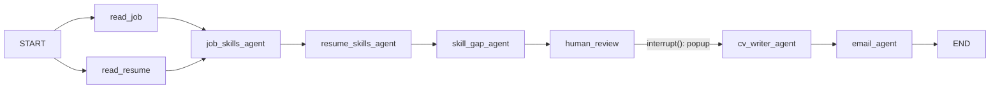

# Job Apply Agent

A LangGraph agent with a React (Next.js) UI. Give it a job posting (link, screenshot or pasted text) and your resume PDF. It:

1. **Reads both in parallel.** It fetches the job link or OCRs the screenshot, and extracts the resume text (OCR if the PDF is scanned).
2. **Job requirements agent:** lists the job's required and preferred skills and every contact email.
3. **Resume skills agent:** lists the skills your resume shows.
4. **Skill gap agent:** finds the major skills you're missing and shows them in a **popup**. You tick the ones you really have and can say how you used each.
5. **CV writer agent:** updates your CV with the approved skills, without inventing employers, dates or numbers.
6. **Email agent:** drafts the application email to the addresses found in the posting.

You get the email draft (editable, copy or open in your mail app) and the updated CV (preview and PDF download).

## The graph



Only the two readers run in parallel. `job_skills_agent` waits for both, and everything after it runs one step at a time.

| File | Contents |
| --- | --- |
| `src/lib/agent/graph.ts` | Graph wiring: nodes, parallel fan-out, join |
| `src/lib/agent/nodes.ts` | The agents and their prompts |
| `src/lib/agent/state.ts` | Graph state (`Annotation.Root`) |
| `src/lib/agent/schemas.ts` | Zod schemas for structured output and requests |
| `src/lib/agent/readers.ts` | Job page scraping (JSON-LD `JobPosting` first) and PDF text extraction |
| `src/lib/agent/runner.ts` | Runs the graph, streams events, pause and resume |
| `src/app/api/analyze` | Phase 1: read → extract → compare → pause at the review |
| `src/app/api/resume` | Phase 2: your decision → CV → email |
| `src/app/page.tsx` | The UI |

### How the approval popup works on serverless

`human_review` calls LangGraph's `interrupt()`, which pauses the run. On Vercel the second request (your answer) can reach a different server instance, so an in-memory checkpoint may be gone by then. Instead, the paused state (the text and analysis, not your uploads) is sent to the browser with the popup and sent back with your answer. The server seeds a fresh thread with it using `graph.updateState(..., "skill_gap_agent")` and resumes with `Command({ resume: decision })`. No database is needed.

## Run locally

Requires Node.js 20.9 or later.

```bash
npm install
cp .env.example .env.local   # then add OPENAI_API_KEY or ANTHROPIC_API_KEY
npm run dev                  # http://localhost:3000
npm test                     # graph tests with a fake model, no API key needed
```

## Model configuration

| Variable | Purpose |
| --- | --- |
| `OPENAI_API_KEY` or `ANTHROPIC_API_KEY` | Required, one of them |
| `LLM_PROVIDER` | `openai` or `anthropic`, when both keys are set |
| `LLM_MODEL` | Defaults to `gpt-5-mini` / `claude-sonnet-5`. It must accept images, for screenshot OCR |
| `OPENAI_BASE_URL` | Azure OpenAI (`https://<resource>.openai.azure.com/openai/v1/`, with the deployment name as `LLM_MODEL`) or another OpenAI-compatible API |
| `ACCESS_CODE` | Optional. The UI asks for this code before running, so strangers can't use your API key |

## Deploy to Vercel

1. Push this repository to GitHub.
2. On [vercel.com/new](https://vercel.com/new), import the repository. Vercel detects Next.js; keep the defaults.
3. Under **Environment Variables**, add your API key and an `ACCESS_CODE`.
4. Click **Deploy**.

Or from the command line: `npx vercel` (preview), then `npx vercel --prod`.

Limits to be aware of:

- **Function duration.** The API routes set `maxDuration = 300` seconds, the Hobby maximum with Fluid compute (on by default for new projects). If your project has Fluid compute turned off, the Hobby limit is 60 seconds; lower `maxDuration` in both `route.ts` files, or turn Fluid compute on.
- **Upload size.** Vercel accepts request bodies up to 4.5 MB. The UI compresses screenshots and limits the resume PDF to 3 MB.
- **Job links.** Pages that need a login or render only with JavaScript (often LinkedIn) can't be fetched. Upload a screenshot or paste the text instead.
